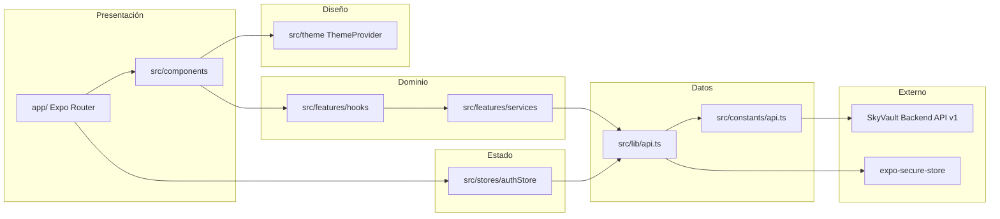
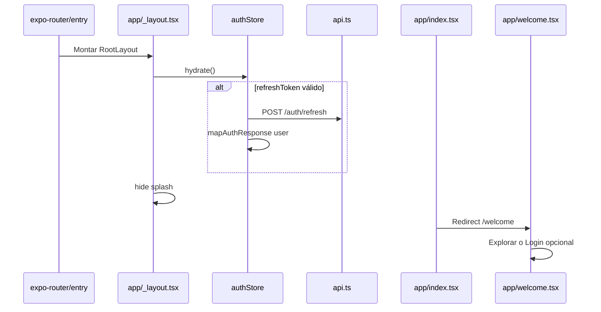

# SCHEMA — Arquitectura y estructura de SkyVault Mobile

Documentación del árbol de directorios, responsabilidades por módulo, flujos de datos y conexión con el backend API v1.

**Versión documentada:** 1.8.0

---

## Árbol de directorios

```
skyvault-mobile/
├── app/                              # Expo Router
│   ├── _layout.tsx                   # Root: fuentes, splash, ThemeProvider, Stack
│   ├── index.tsx                     # Redirect → /welcome
│   ├── welcome.tsx                   # Home pública (hero, logo, CTAs)
│   ├── (auth)/
│   │   ├── _layout.tsx
│   │   ├── login.tsx
│   │   └── register.tsx
│   ├── dashboard/                    # Stack autenticado (RBAC)
│   │   ├── favorites, comparisons, profile, updates, updates/new, users, aircraft, aircraft-form, settings
│   ├── (tabs)/
│   │   ├── _layout.tsx               # Tab bar (5 tabs)
│   │   ├── index.tsx                 # Home: AuthGate (invitado) o dashboard por rol
│   │   ├── search.tsx
│   │   ├── compare.tsx
│   │   ├── stats.tsx
│   │   └── profile.tsx
│   ├── aircraft/
│   │   └── [id].tsx                  # Detalle de aeronave
│   ├── manufacturers/
│   │   └── [id].tsx
│   └── families/
│       └── [id].tsx
│
├── src/
│   ├── constants/api.ts
│   ├── lib/api.ts
│   ├── stores/authStore.ts
│   ├── theme/                        # colors, spacing, typography, ThemeProvider
│   ├── shared/
│   │   ├── types/                    # aircraft, comparison, statistics, api
│   │   └── utils/                    # errorMessages, network
│   ├── features/
│   │   ├── aircraft/                 # services, hooks
│   │   ├── auth/                     # mapAuthResponse, userService, favorites
│   │   ├── comparison/
│   │   ├── dashboard/
│   │   ├── admin/                    # usuarios admin
│   │   ├── notifications/            # REST + STOMP
│   │   ├── families/
│   │   ├── home/                     # AuthGateHomeView
│   │   ├── statistics/
│   │   └── welcome/                  # motion hooks
│   └── components/
│       ├── ui/                       # Button, Input, GlassCard, Badge, Skeleton
│       ├── native/                   # AircraftCard, SearchBar, HeroImage, …
│       ├── swiftui/                  # @expo/ui wrappers (iOS)
│       └── platform/                 # PlatformFilterForm, PlatformSpecificationsForm
│
├── assets/
├── babel.config.js
├── eas.json
├── .env.example
├── app.json
├── package.json                      # main: expo-router/entry
├── AGENTS.md
├── README.md
├── CONTRIBUTING.md
└── .gitignore
```

**Generados / ignorados:** `node_modules/`, `.expo/`, `ios/`, `android/` (prebuild).

---

## Diagrama de capas



---

## Entry point y arranque

| Archivo | Rol |
|---------|-----|
| `package.json` → `"main": "expo-router/entry"` | Entry real |
| `app/_layout.tsx` | Splash, Inter, `hydrate()`, `GestureHandlerRootView`, `ThemeProvider`, `Stack` |
| `app/index.tsx` | `Redirect` → `/welcome` |

### Flujo de arranque



---

## Expo Router — rutas

| Ruta | Archivo | Descripción |
|------|---------|-------------|
| `/` | `app/index.tsx` | Redirect a welcome |
| `/welcome` | `app/welcome.tsx` | Home pública (paridad web) |
| `/(auth)/login` | `app/(auth)/login.tsx` | Login |
| `/(auth)/register` | `app/(auth)/register.tsx` | Registro |
| `/(tabs)/` | `app/(tabs)/index.tsx` | Home — catálogo |
| `/(tabs)/search` | `app/(tabs)/search.tsx` | Búsqueda + suggest |
| `/(tabs)/compare` | `app/(tabs)/compare.tsx` | Comparador |
| `/(tabs)/stats` | `app/(tabs)/stats.tsx` | Estadísticas |
| `/(tabs)/profile` | `app/(tabs)/profile.tsx` | Perfil + logout + tema |
| `/aircraft/[id]` | `app/aircraft/[id].tsx` | Detalle |
| `/manufacturers/[id]` | `app/manufacturers/[id].tsx` | Por fabricante |
| `/families/[id]` | `app/families/[id].tsx` | Familia + aeronaves |

Navegación pública: `(tabs)` accesible sin sesión. Perfil sin sesión muestra CTAs de login/registro.

---

## Módulos clave

### `src/stores/authStore.ts`

| Método | Descripción |
|--------|-------------|
| `hydrate()` | Restaurar sesión con refresh token |
| `login(email, password)` | Login + `mapAuthResponse` (sin GET /auth/me) |
| `register(username, email, password)` | Registro + sesión |
| `logout()` | Cerrar sesión |
| `setUser()` | Actualizar perfil en memoria |

### `src/lib/api.ts`

- `tokenManager` — access token en memoria.
- Interceptor 401 — cola + refresh + reintento.
- Rutas públicas auth: solo `/auth/login`, `/auth/register`, `/auth/refresh` omiten Bearer.
- Refresh token en `expo-secure-store`.

### `src/features/`

| Feature | Servicio | Hooks |
|---------|----------|-------|
| aircraft | `aircraftService` | `useAircraftCatalog`, `useAircraftDetail` |
| comparison | `comparisonService` | `useComparison` |
| statistics | `statisticsService` | `useStatistics` |
| auth | `userService` | `useFavorites` |
| families | `familyService` | `useFamilyDetail` |

Regla: **pantalla → hook → service → api** (los componentes no llaman REST directamente).

### `src/theme/`

- `colors.ts`, `spacing.ts`, `typography.ts`
- `ThemeProvider.tsx` + `useTheme()` — light/dark con override manual

---

## Endpoints en uso (v1.3.0)

| Grupo | Rutas | Pantallas |
|-------|-------|-----------|
| AUTH | login, register, refresh, logout | auth, hydrate |
| ME | profile, favorites add/remove | Profile, FavoriteToggle |
| AIRCRAFT | list, detail, search | Home, Search, Detail |
| SEARCH | suggest | Search autocomplete |
| AIRCRAFT | compare | Compare tab |
| STATISTICS | system, aircraft, popular/* | Stats tab |
| MANUFACTURERS | summary, aircraft by manufacturer | Manufacturers screen |
| FAMILIES | detail, aircraft | Families screen |

`WS_URL` definido; sin cliente WebSocket.

---

## Configuración

### `app.json`

| Campo | Valor |
|-------|-------|
| `version` | 1.8.0 |
| `scheme` | skyvault |
| `ios.bundleIdentifier` | com.skyvault.mobile |
| `android.package` | com.skyvault.mobile |
| `plugins` | expo-secure-store, expo-font, expo-router |

### Toolchain

- `babel.config.js` — `babel-preset-expo` + `react-native-reanimated/plugin`
- `metro.config.js` — `react-native-svg-transformer` para logo SVG
- `eas.json` — perfil `preview` (iOS internal + Android APK)

---

## Deuda técnica

1. **WebSocket** — constante sin implementación.
2. **Dashboard admin / noticias** — fuera del alcance v1.3.0.
3. **Expo Go vs dev build** — `@expo/ui` puede requerir `npx expo run:ios` en algunos dispositivos.
4. **Tests E2E** — no incluidos.

---

## Referencias cruzadas

- [README.md](./README.md) — comandos, variables, troubleshooting
- [CONTRIBUTING.md](./CONTRIBUTING.md) — changelog v1.3.0
