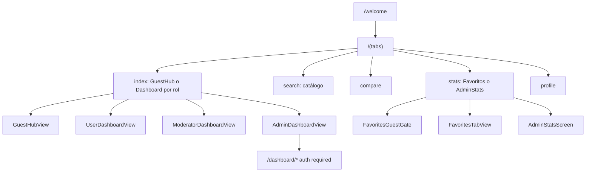
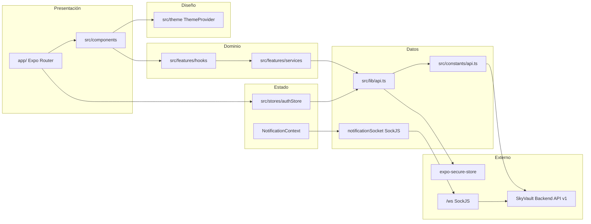
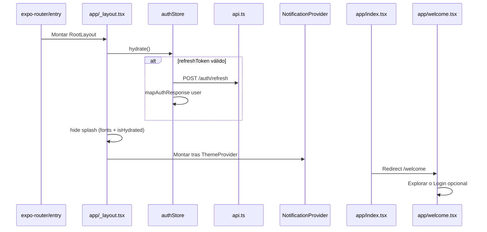

# SCHEMA — Arquitectura y estructura de SkyVault Mobile

Mapa de navegación (Expo Router), capas de `src/`, providers en el root, flujos de datos y conexión con el backend API v1. Para listas, refresh y fluidez ver [PERFORMANCE.md](./PERFORMANCE.md).

**Versión documentada:** 1.9.5

---

## Árbol de directorios

```
skyvault-mobile/
├── app/                              # Expo Router (pantallas)
│   ├── _layout.tsx                   # Root: fuentes, splash, hydrate, providers, Stack
│   ├── index.tsx                     # Redirect → /welcome
│   ├── welcome.tsx                   # Home pública (hero, logo, CTAs)
│   ├── (auth)/
│   │   ├── _layout.tsx
│   │   ├── login.tsx
│   │   └── register.tsx
│   ├── (tabs)/
│   │   ├── _layout.tsx               # Tab bar (5 tabs; 4ª dinámica por rol)
│   │   ├── index.tsx                 # Inicio: GuestHub o dashboard por rol
│   │   ├── search.tsx                # Catálogo + filtros modal
│   │   ├── compare.tsx               # Comparador 2–3 columnas
│   │   ├── stats.tsx                 # Favoritos o AdminStats (por rol)
│   │   └── profile.tsx               # Cuenta, tema, CTAs invitado
│   ├── dashboard/                    # Stack autenticado (guard en _layout)
│   │   ├── _layout.tsx
│   │   ├── favorites.tsx
│   │   ├── comparisons.tsx
│   │   ├── profile.tsx               # Editar perfil
│   │   ├── updates.tsx
│   │   ├── updates/new.tsx
│   │   ├── users.tsx
│   │   ├── aircraft.tsx
│   │   ├── aircraft-form.tsx
│   │   └── settings.tsx
│   ├── aircraft/
│   │   └── [id].tsx                  # Detalle + AircraftSpecsTabs
│   ├── manufacturers/
│   │   ├── index.tsx
│   │   └── [id].tsx
│   └── families/
│       ├── index.tsx
│       └── [id].tsx
│
├── src/
│   ├── constants/
│   │   └── api.ts                    # Rutas REST + WS_URL (1:1 con web)
│   ├── lib/
│   │   └── api.ts                    # Axios, tokenManager, refresh queue
│   ├── stores/
│   │   └── authStore.ts              # Zustand: login, hydrate, logout
│   ├── theme/                        # colors, spacing, typography, ThemeProvider
│   ├── hooks/
│   │   └── useStaggerEntrance.ts
│   ├── utils/
│   │   └── expoUiAvailable.ts        # Detección @expo/ui en iOS
│   ├── shared/
│   │   ├── types/                    # aircraft, comparison, statistics, api
│   │   ├── copy/                     # labels, productionStateLabel, notificationCopy
│   │   ├── constants/
│   │   │   └── flatListPerf.ts       # Props FlatList compartidas
│   │   └── utils/                    # errorMessages, network, springPage
│   ├── features/
│   │   ├── aircraft/
│   │   ├── auth/
│   │   ├── comparison/
│   │   ├── statistics/
│   │   ├── favorites/
│   │   ├── notifications/
│   │   ├── admin/
│   │   ├── dashboard/
│   │   ├── families/
│   │   ├── home/
│   │   └── welcome/
│   └── components/
│       ├── ui/                       # Button, Input, GlassCard, liquid-glass/
│       ├── native/                   # Cards, specs, skeleton, logo
│       ├── media/                    # AircraftThumbnail, ImagePreviewModal
│       ├── motion/                   # BreathingCard, ScrollRevealSection
│       ├── feedback/                 # ActionSuccessModal
│       ├── layout/                   # DashboardHeroHeader
│       ├── navigation/               # TabHeaderRight (campana)
│       ├── platform/                 # Formularios RN (Expo Go)
│       └── swiftui/                  # Wrappers @expo/ui (iOS dev build)
│
├── assets/
├── babel.config.js
├── metro.config.js                   # react-native-svg-transformer
├── eas.json
├── .env.example
├── app.json
├── package.json                      # main: expo-router/entry
├── README.md
├── PERFORMANCE.md
├── CONTRIBUTING.md
└── AGENTS.md
```

**Generados / ignorados:** `node_modules/`, `.expo/`, `ios/`, `android/` (prebuild).

---

## Navegación por rol



---

## Diagrama de capas



---

## Entry point y arranque

| Archivo | Rol |
|---------|-----|
| `package.json` → `"main": "expo-router/entry"` | Entry real |
| `app/_layout.tsx` | Splash, Inter, `hydrate()`, providers, `Stack` |
| `app/index.tsx` | `Redirect` → `/welcome` |

### Providers (orden real en `app/_layout.tsx`)

1. `GestureHandlerRootView`
2. `ThemeProvider`
3. `NotificationProvider` (inbox REST + SockJS/STOMP)
4. `RootNavigator` (`Stack`)

### Flujo de arranque



---

## Expo Router — rutas

| Ruta | Archivo | Descripción |
|------|---------|-------------|
| `/` | `app/index.tsx` | Redirect a `/welcome` |
| `/welcome` | `app/welcome.tsx` | Home pública (paridad web, motion) |
| `/(auth)/login` | `app/(auth)/login.tsx` | Login |
| `/(auth)/register` | `app/(auth)/register.tsx` | Registro |
| `/(tabs)/` | `app/(tabs)/index.tsx` | Inicio: `GuestHubView` (invitado) o `*DashboardView` por rol |
| `/(tabs)/search` | `app/(tabs)/search.tsx` | Catálogo, `CatalogFilterModal`, suggest |
| `/(tabs)/compare` | `app/(tabs)/compare.tsx` | Comparador con `ComparisonGrid` |
| `/(tabs)/stats` | `app/(tabs)/stats.tsx` | Invitado → gate; USER/MOD → favoritos; ADMIN → `AdminStatsScreen` |
| `/(tabs)/profile` | `app/(tabs)/profile.tsx` | Perfil, logout, tema; invitado → CTAs auth |
| `/dashboard/favorites` | `app/dashboard/favorites.tsx` | Lista favoritos (stack) |
| `/dashboard/comparisons` | `app/dashboard/comparisons.tsx` | Historial comparaciones |
| `/dashboard/profile` | `app/dashboard/profile.tsx` | Edición perfil + `ActionSuccessModal` |
| `/dashboard/updates` | `app/dashboard/updates.tsx` | Moderación updates (admin/mod) |
| `/dashboard/updates/new` | `app/dashboard/updates/new.tsx` | Crear update (`title` + `content`) |
| `/dashboard/users` | `app/dashboard/users.tsx` | Admin usuarios + `UserEditModal` |
| `/dashboard/aircraft` | `app/dashboard/aircraft.tsx` | Listado admin aeronaves |
| `/dashboard/aircraft-form` | `app/dashboard/aircraft-form.tsx` | Redirect / formulario legacy → dashboard aircraft |
| `/dashboard/settings` | `app/dashboard/settings.tsx` | Ajustes cuenta |
| `/aircraft/[id]` | `app/aircraft/[id].tsx` | Detalle, specs tabs, favoritos |
| `/manufacturers` | `app/manufacturers/index.tsx` | Listado fabricantes |
| `/manufacturers/[id]` | `app/manufacturers/[id].tsx` | Aeronaves por fabricante |
| `/families` | `app/families/index.tsx` | Listado familias |
| `/families/[id]` | `app/families/[id].tsx` | Detalle familia + aeronaves |

**Navegación pública:** `(tabs)` accesible sin sesión. `dashboard/*` exige usuario (`Redirect` a login en `dashboard/_layout.tsx`). Header derecho en tabs: `TabHeaderRight` (campana de notificaciones).

**Cuarta tab:** título e icono en `(tabs)/_layout.tsx` — invitado / USER / MOD → «Favoritos» (`Heart`); ADMIN → «Estadísticas» (`BarChart3`).

---

## RBAC

| Rol | Inicio (`index`) | Tab `stats` | Dashboard |
|-----|------------------|-------------|-----------|
| Invitado | `GuestHubView` | `FavoritesGuestGate` | Redirect login |
| `ROLE_USER` | `UserDashboardView` | `FavoritesTabView` | Según permisos |
| `ROLE_MODERATOR` | `ModeratorDashboardView` | `FavoritesTabView` | Updates, moderación |
| `ROLE_ADMIN` | `AdminDashboardView` | `AdminStatsScreen` | Users, aircraft, updates, stats |

- **`useAuth`** (`src/features/auth/hooks/useAuth.ts`): `user`, `isAdmin`, `isModerator`, `isHydrated`.
- **`RequireRole`** (`src/features/auth/components/RequireRole.tsx`): guard de UI por rol.
- **`requireRole`** (`src/features/auth/utils/requireRole.ts`): utilidades de comprobación.

---

## Módulos `src/features/`

| Módulo | Responsabilidad | Servicio / hooks / UI clave |
|--------|-----------------|------------------------------|
| `aircraft/` | Catálogo, detalle, admin, formulario | `aircraftService`, `useAircraftCatalog`, `useAircraftDetail`, `useAdminAircraftList`, `AircraftFormModal`, `CatalogFilterModal`, `aircraftFormUtils` |
| `auth/` | Sesión, favoritos, RBAC | `userService`, `mapAuthResponse`, `useAuth`, `useFavorites`, `FavoriteToggle`, `RequireRole` |
| `comparison/` | Comparador y picker | `comparisonService`, `useComparison`, `ComparisonGrid`, `ComparisonSection`, `AircraftPickerModal`, `CompareAircraftStrip` |
| `statistics/` | KPIs admin (tab stats) | `statisticsService`, `useStatistics`, `AdminStatsScreen`, `StatsKpiCarousel`, `StatsSegmentSlider`, `StatsRankingList` |
| `favorites/` | Tab favoritos (no admin) | `FavoritesTabView`, `FavoritesGuestGate` |
| `notifications/` | Inbox REST + tiempo real | `notificationService`, `notificationSocket` (SockJS), `NotificationProvider`, `NotificationContext`, `normalizeNotification`, bell/sheet/toasts, `resolveActionRoute` |
| `admin/` | Usuarios admin | `adminUserService`, `useAdminUsers`, `UserEditModal` |
| `dashboard/` | Home por rol, updates, insights | `*DashboardView`, `dashboardAdminService`, `updatesApiService`, `useAdminStats`, `useUserComparisonInsights`, `useMutationFeedback`, `UpdateDetailModal`, `compareHistory` |
| `families/` | Familias | `familyService`, `useFamilyDetail` |
| `home/` | Hub invitado, marketing | `GuestHubView`, `AuthGateHomeView`, `HomeMarketingView`, `SkyVaultParticleHero` |
| `welcome/` | Motion pantalla welcome | `useWelcomeMotion` |

**Regla:** pantalla → hook → service → `api.ts` (los componentes no llaman REST directamente).

---

## `src/components/`

| Carpeta | Contenido |
|---------|-----------|
| `ui/` | `Button`, `Input`, `GlassCard`, `Badge`, `Skeleton`; `liquid-glass/` → `LiquidGlassSurface`, `LiquidGlassButton`, `GlassSearchBar` |
| `native/` | `AircraftCard`, `CatalogAircraftCard`, `AdminAircraftRow`, `AircraftSpecsTabs`, `AircraftOverviewSection`, `SearchBar`, `HeroImage`, `SkeletonLoader`, `EmptyState`, `SkyVaultLogo`, formularios legacy |
| `media/` | `AircraftThumbnail` (88×88 cover), `ImagePreviewModal` |
| `motion/` | `BreathingCard`, `ScrollRevealSection` |
| `feedback/` | `ActionSuccessModal` |
| `layout/` | `DashboardHeroHeader` |
| `navigation/` | `TabHeaderRight` (notificaciones en header tabs) |
| `platform/` | `PlatformFilterForm`, `PlatformSpecificationsForm` (RN puro, Expo Go) |
| `swiftui/` | `FilterFormSwift`, `SpecificationsFormSwift`, `StatsProgress` (`@expo/ui`, iOS) |

---

## `src/shared/`, raíz y estado

| Ruta | Rol |
|------|-----|
| `shared/types/` | DTOs TypeScript alineados al backend |
| `shared/copy/` | Textos UI (`labels`, `productionStateLabel`, `notificationCopy`) |
| `shared/constants/flatListPerf.ts` | Props recomendadas FlatList — ver [PERFORMANCE.md](./PERFORMANCE.md) |
| `shared/utils/` | `errorMessages`, `network`, `springPage` |
| `constants/api.ts` | Mapa `API` + `BASE_URL` + `WS_URL` |
| `lib/api.ts` | Cliente Axios, cola 401, refresh |
| `stores/authStore.ts` | Estado global de sesión |
| `theme/` | Tokens + `useTheme()` |

### `src/stores/authStore.ts`

| Método | Descripción |
|--------|-------------|
| `hydrate()` | Restaurar sesión con refresh token |
| `login(email, password)` | Login + `mapAuthResponse` (sin GET /auth/me extra) |
| `register(username, email, password)` | Registro + sesión |
| `logout()` | Cerrar sesión |
| `setUser()` | Actualizar perfil en memoria |

### `src/lib/api.ts`

- `tokenManager` — access token solo en memoria.
- Interceptor 401 — cola + refresh + reintento.
- Rutas públicas sin Bearer: `/auth/login`, `/auth/register`, `/auth/refresh`.
- Refresh token en `expo-secure-store`.

### `src/theme/`

- `colors.ts`, `spacing.ts`, `typography.ts`
- `ThemeProvider.tsx` + `useTheme()` — light/dark con override manual

---

## Hooks → pantallas

| Hook | Pantalla / uso |
|------|----------------|
| `useAircraftCatalog` | `app/(tabs)/search.tsx` |
| `useAircraftDetail` | `app/aircraft/[id].tsx` |
| `useAdminAircraftList` | `app/dashboard/aircraft.tsx` |
| `useComparison` | `app/(tabs)/compare.tsx` |
| `useStatistics` | `AdminStatsScreen` (tab stats admin) |
| `useFavorites` | `FavoritesTabView`, favoritos dashboard |
| `useAdminUsers` | `app/dashboard/users.tsx` |
| `useFamilyDetail` | `app/families/[id].tsx` |
| `useAuth` | Layouts, guards, dashboards |
| `useAdminStats` | Vistas admin dashboard |
| `useUserComparisonInsights` | Dashboard usuario |
| `useMutationFeedback` | Perfil, `UserEditModal`, `AircraftFormModal` |

---

## Notificaciones (tiempo real)

| Pieza | Archivo | Notas |
|-------|---------|-------|
| REST inbox | `notificationService.ts` | `API.ME.NOTIFICATIONS*`, unread-count |
| Socket | `notificationSocket.ts` | SockJS + `@stomp/stompjs`; `EXPO_PUBLIC_WS_URL` (ej. `http://host:8080/ws`) |
| Normalización | `normalizeNotification.ts` | IDs y campos al recibir WS o REST |
| Contexto | `NotificationContext.ts` | Evita require cycle con el sheet |
| Provider | `NotificationProvider.tsx` | Toast, pulse, `AppState` active → reconectar + refresh |
| UI | `NotificationBell`, `NotificationSheet`, `NotificationToastHost` | Header + sheet + toasts glass |
| Deep link | `resolveActionRoute.ts` | Navegación desde payload de notificación |

Poll de respaldo: 60 s conectado / 10 s desconectado. Haptics en feedback (sin `expo-av`). Ver [PERFORMANCE.md](./PERFORMANCE.md) para `InteractionManager` al volver a `active`.

---

## Endpoints en uso (por feature)

| Grupo | Rutas (`API.*`) | Pantallas / módulos |
|-------|-----------------|---------------------|
| AUTH | login, register, refresh, logout | `(auth)`, `hydrate` |
| ME | profile, update, favorites, notifications | Perfil, favoritos, inbox |
| AIRCRAFT | list, detail, search, compare, popular, featured | Search, detail, compare, admin aircraft |
| CATALOG | types, production-states, size-categories, determine | Filtros catálogo, formulario aeronave |
| SEARCH | suggest, global, aircraft, advanced | Search autocomplete |
| MANUFACTURERS | list, summary, by id, aircraft | `manufacturers/*` |
| FAMILIES | list, detail, aircraft | `families/*` |
| STATISTICS | system, aircraft, distributions, popular/* | `AdminStatsScreen` |
| UPDATES | base, approve, reject, categories | `dashboard/updates`, `updates/new` |
| ADMIN | users, role, activate, deactivate, stats, aircraft | `dashboard/users`, admin home |
| WS | SockJS en `/ws` | `notificationSocket` |

Constantes completas: [`src/constants/api.ts`](src/constants/api.ts).

---

## Configuración

### `app.json`

| Campo | Valor |
|-------|-------|
| `version` | 1.9.5 |
| `scheme` | skyvault |
| `ios.bundleIdentifier` | com.skyvault.mobile |
| `android.package` | com.skyvault.mobile |
| `plugins` | expo-secure-store, expo-font, expo-router |

### Toolchain

- `babel.config.js` — `babel-preset-expo` + `react-native-reanimated/plugin`
- `metro.config.js` — `react-native-svg-transformer` para logo SVG
- `eas.json` — perfil `preview` (iOS internal + Android APK)

### Variables de entorno

| Variable | Uso |
|----------|-----|
| `EXPO_PUBLIC_API_BASE_URL` | REST (`/api/v1`) |
| `EXPO_PUBLIC_WS_URL` | SockJS STOMP notificaciones |

---

## Deuda técnica y roadmap

| Tema | Estado v1.9.5 |
|------|----------------|
| Cliente WebSocket / STOMP | **Implementado** (SockJS; backend no expone WS crudo en iOS) |
| Dashboard admin | **Implementado** (`app/dashboard/*`) |
| Push nativo FCM/APNs | Pendiente |
| FLIP modal admin (GSAP web) | Pendiente |
| Noticias, About, FAQ | Pendiente |
| Live Activities / Dynamic Island (v2.0) | Roadmap — development build, no Expo Go |
| Tests E2E | No incluidos |
| Expo Go vs dev build | `@expo/ui` / SwiftUI opcional con `npx expo run:ios` |

---

## Referencias cruzadas

| Tema | Archivo |
|------|---------|
| Comandos, env, troubleshooting | [README.md](./README.md) |
| Listas, refresh, mutaciones | [PERFORMANCE.md](./PERFORMANCE.md) |
| Changelog y contribución | [CONTRIBUTING.md](./CONTRIBUTING.md) (v1.9.5) |
| Reglas IA / Expo 55 | [AGENTS.md](./AGENTS.md) |
